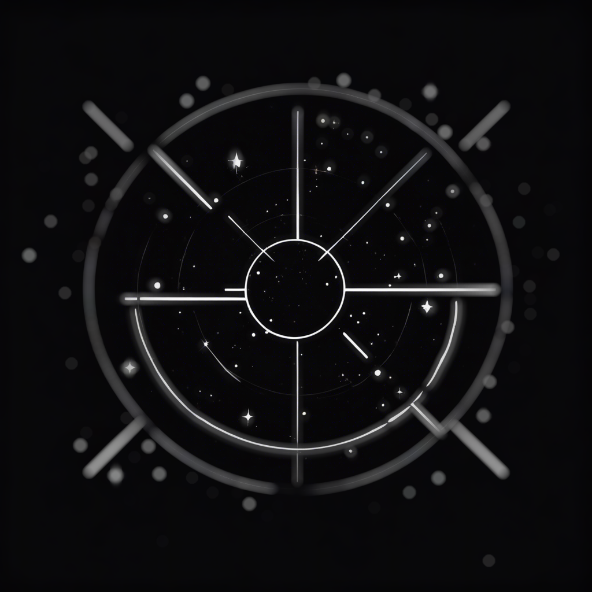

# AstrAFocus

A Python package for automated telescope focusing.

<p align="center">
   
</p>

*AstrAFocus* solves two problems: finding suitable sky regions for focus calibration, and performing the autofocus sweep itself. It is hardware-agnostic — connect real devices by implementing two small interface classes, or use the built-in simulators for development and testing.

**[Documentation](https://dgegen.github.io/astrafocus/)**

## Installation

```bash
pip install astrafocus
```

Or from source using [uv](https://docs.astral.sh/uv/):

```bash
git clone https://github.com/dgegen/astrafocus.git
cd astrafocus
uv sync
```

For development (includes linting, docs, and test dependencies):

```bash
uv sync --group dev --group docs --group test
```

Optional extras:

```bash
pip install "astrafocus[alpaca]"       # ASCOM Alpaca device support (alpyca)
pip install "astrafocus[visualization]" # matplotlib, IPython, notebook
pip install "astrafocus[extended]"     # scikit-learn for additional estimators
```

## Quick start

```python
from astrafocus.interface.simulation import CabaretDeviceSimulator
from astrafocus.autofocuser import AnalyticResponseAutofocuser
from astrafocus.star_size_focus_measure_operators import HFRStarFocusMeasure

simulator = CabaretDeviceSimulator(current_position=11_000, allowed_range=(9_000, 13_000))

autofocuser = AnalyticResponseAutofocuser(
    autofocus_device_manager=simulator,
    exposure_time=3.0,
    focus_measure_operator=HFRStarFocusMeasure,
    n_steps=(20, 10),
)
autofocuser.run()
print(f"Best focus position: {autofocuser.best_focus_position}")
```

See the [Getting Started](https://dgegen.github.io/astrafocus/notebooks/getting_started.html) notebook for a full walkthrough, or `explorations/speculoos_main.py` for a more complete real-world example.

## Key components

### Autofocus

- **`AnalyticResponseAutofocuser`** — sweeps the focuser through a range of positions, measures focus quality, and fits an analytic curve (e.g. parabola) to locate the optimum.
- **`NonParametricResponseAutofocuser`** — same sweep strategy, but uses a non-parametric smoother (LOWESS, spline, or RBF) instead of an analytic fit. Works with any focus measure operator.
- **`FocusMeasureOperatorRegistry`** — 13 built-in operators: star-size estimators (`hfr`, `gauss`) and image-sharpness metrics (`fft`, `tenengrad`, `laplacian`, `brenner`, …).

### Choosing a focus measure

- **Coarse Search (e.g., `fft`)**: Best for broad ranges where stars appear as blurry "donuts." These non-parametric operators measure overall frame sharpness without needing to identify individual stars, making them nearly impossible to "confuse" with distorted optics.

- **Fine Tuning (e.g., `HFR`)**: Best for precision near the focus peak. These algorithms fit a "V-curve" to the diameters of detected stars. They provide great accuracy once stars are point-like, but will fail during wide searches if the stars are too bloated to be recognized by the star-finder.

### Sky targeting

- **`ZenithNeighbourhoodQuery`** — queries a Gaia-2MASS catalogue (local SQLite or remote) to find a region near zenith with a suitable density of stars for focus calibration.

### Hardware interface

Connect real hardware by implementing two classes:

- **`CameraInterface`** — one method: `perform_exposure(texp)`.
- **`FocuserInterface`** — one method: `move_focuser_to_position(position)`.

Wrap them in `AutofocusDeviceManager` and pass it to any autofocuser. For hardware-free development and testing, use the built-in `CabaretDeviceSimulator` (synthetic images) or `ObservationBasedDeviceSimulator` (replay from FITS files).

## The Gaia-2MASS Local Catalogue

The sky-targeting component requires a local Gaia-2MASS catalogue. A citable snapshot is available on Zenodo: https://zenodo.org/records/18214672 (DOI: 10.5281/zenodo.18214672). The original repository with build scripts and source data is available at [ppp-one/gaia-tmass-sqlite](https://github.com/ppp-one/gaia-tmass-sqlite).

## Citation

If you use AstraFocus in your research, please cite it. A DOI is minted via [Zenodo](https://zenodo.org) for each release. Use the **Cite this repository** button on GitHub for an up-to-date citation in your preferred format.

May your stars align and your focus be as sharp as a caffeinated owl spotting its prey!
